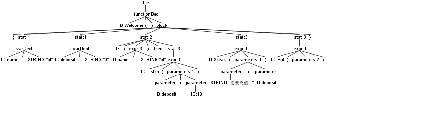
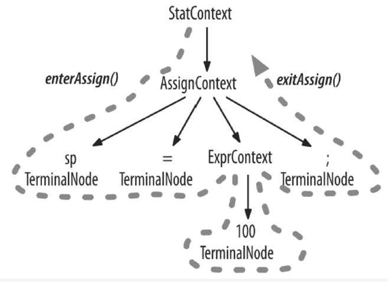

# 语法分析树

使用以下代码为例

```
Welcome()
{
    name="cl"
    deposit="0"
    if(name=="cl") then Listen(deposit + 10)
    Speak("您要充值：" + deposit)
    Exit()
}
```

根据[语法规则](../src/Server.g4)，生成一颗语法分析树



# 遍历树

```
// key为变量名，value为变量值
map<string, string> memory;
// key为函数名，value为函数节点
map<string, ServerParser::FunctionDeclContext *> callMap;
```


采用深度优先遍历一次树，遇到变量声明存入memory，遇到函数声明存入callMap



再遍历一次树，这次只访问主函数(Welcome)，遇到expr就查找callMap，紧接着访问查找到的函数节点，实现函数调用